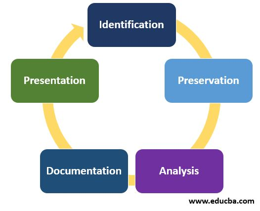

# Introduction to Digital Forensics Investigation

# Table of Contents

-------------------------
# Digital Forensics Investigation Process

# Objectives of this course

- Understand the digital forensics investigation process
- Explain the importance of digital evidence and the role between public and private sector
- Explaining the importance of maintaining professional conduct

# Overview of Digital Forensics Investigation Process

