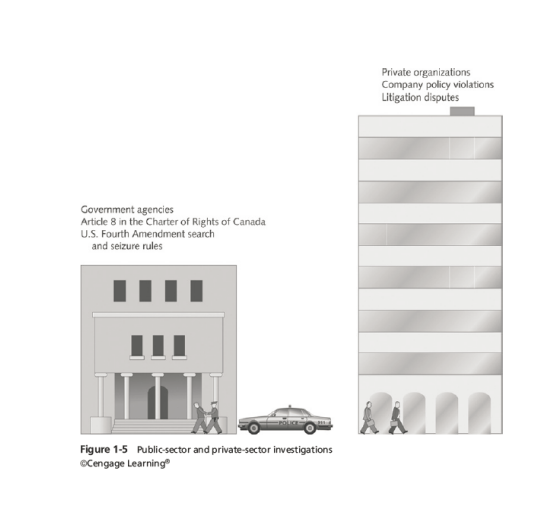

# Introduction to Digital Forensics Investigation

# Table of Contents

-------------------------
# Digital Forensics Investigation Process

# Objectives of this course

- Understand the digital forensics investigation process
- Explain the importance of digital evidence and the role between public and private sector
- Explaining the importance of maintaining professional conduct

# Overview of Digital Forensics Investigation Process
- The Federal Rules of Evidence (FRE) governs the admissibility of evidence in federal courts.
- FBI Computer Analysis and Response Team (CART) is a group of FBI agents who specialize in computer forensics.
- By late 1990s, the FBI had established regional computer forensics laboratories (RCFLs) to provide computer forensic services to local, state, and federal law enforcement agencies.

## The Fourth Amendment
- The Fourth Amendment to the U.S. Constitution protects citizens from unreasonable searches and seizures.
    - The Fourth Amendment applies to government agents, not private citizens.
    - The Fourth Amendment does not apply to searches conducted by private citizens or organizations.
  
# Understanding Case Law 
- Existing case law provides guidance on the admissibility of digital evidence.
- When statutes (a written law passed by a legislative body) do not exist, case law provides guidance on the admissibility of digital evidence.
- Examiners must be familiar with case law to ensure that evidence is admissible in court.

# Developing Digital Forensics Resources
- Learn about the resources available to you as a digital forensics examiner.
- Join computer forensics organizations.
   - Example: Computer Technology Investigators Network (CTIN)
   - Example: High Technology Crime Investigation Association (HTCIA)
   - Example: International Society of Forensic Computer Examiners (ISFCE)
   - Example: International Association of Computer Investigative Specialists (IACIS)

## Digital investigation falls into two categories:
- Public sector Investigation
- Private sector Investigation

