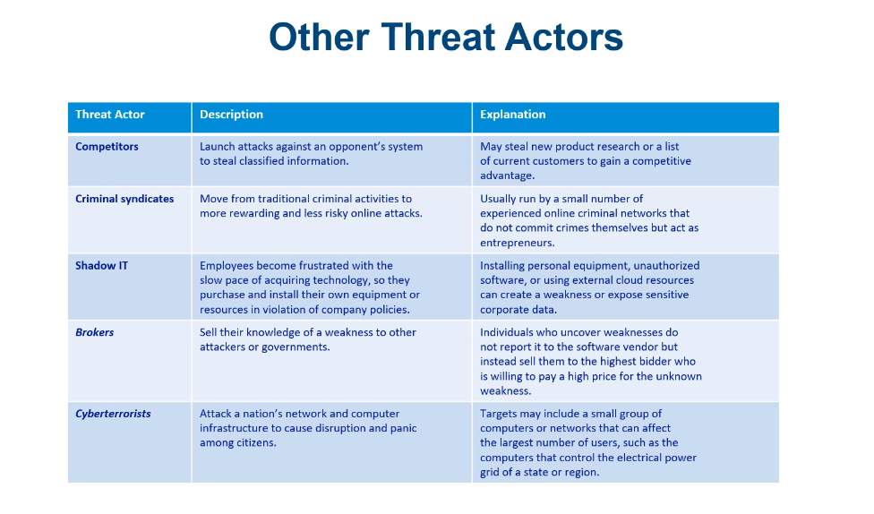

# Topic 1 - Introduction to Information Security and Computer Networks

# Table of Contents

------- 

# What is Information Security?

- The first step in understanding information security is to understand what information is and what it means to an organization.

- Information is an asset that, like other important business assets, is essential to an organization’s business and consequently needs to be suitably protected.

- Understanding Security: Security is a state of well-being of information and infrastructure in which the possibility of theft, tampering, and disruption of information and services is kept low or tolerable.
    - Security is:
    - To be free from danger, which is the goal of information security.
    - The process that achieves and maintains the state of security.

- As security is increasingly becoming a concern for organizations, the need for information security professionals is also increasing.

# Defining Information Security

- Information security discribe the protection of information and its critical elements, including the systems and hardware that use, store, and transmit that information.

    - Manipulation: Unauthorized changes to information.
    - Preservation: Ensuring the information is available to authorized users.
    - Transmission: Ensuring that information is delivered to the intended recipients without any unauthorized interference.

- There are three main objectives of information security:
    - Confidentiality: Ensuring that information is accessible only to those authorized to have access.
    - Integrity: Safeguarding the accuracy and completeness of information and processing methods.
    - Availability: Ensuring that authorized users have access to information and associated assets when required.

- Information security is a multidisciplinary area of study and professional activity that is concerned with the development and implementation of security mechanisms of all available types (technical, organizational, human-oriented, and legal) in order to keep information in all its locations (within and outside the organization’s perimeter) and, consequently, information systems, where information is created, processed, stored, transmitted, and destroyed, free from threats.

# Threat Actors

- A threat actor is a person or element that has the power to carry out a threat.
    - The generic term threat actor is used to refer to any entity that is a source of danger.

- Financial criminals is often divided into three cat
    - Individual users
    - Enterprises
    - Governments

- There are three types of hackers
    - White hat hackers
        - White hat hackers are also known as ethical hackers.
        - Penetration testers are white hat hackers who are hired by organizations to test the security of their information systems.
    - Black hat hackers
        - Black hat hackers are also known as crackers.
        - They are individuals who hack for personal gain or for some malicious intent.
    - Grey hat hackers
        - Grey hat hackers are a blend of both black hat and white hat hackers.

- The term script kiddie is used to describe a person who uses existing computer scripts or code to hack into computers, lacking the expertise to write their own.

# Script Kiddies

- Script kiddies are individuals who use existing computer scripts or code to hack into computers, lacking the expertise to write their own.

- Script kiddies are often young people who lack the ability to write sophisticated code or perform complex tasks.

# Hacktivists
- Individuals who hack for a political or social cause are known as hacktivists.
- These types of attacks by hacktivists are known as hacktivism.
- Hacktivists are often motivated by religious or political beliefs.

# State Actors
- State actors are government-sponsored hackers who are often highly skilled and well-funded.
- Many security experts believe that state actors are behind some of the most sophisticated attacks.
- State actors involve in cyberwarfare.
- APTs (Advanced Persistent Threat) are a group of state-sponsored hackers who are highly skilled and well-funded.

# Insiders
- Insiders are individuals who have legitimate access to an organization’s internal resources.
- These attacks are often difficult to detect and prevent.
- Six our of ten cyberattacks are carried out by insiders.
- The focus of the insiders was: 
- 1. Financial gain
- 2. Disgruntled employees
- 3. Disgruntled ex-employees
- 4. Spies
- 5. Careless employees
- 6. Careless ex-employees

# Other Threat Actors  

# Valunerabilities and Attacks

- A valnerability is a weakness or a fault in a system or protection mechanism that exposes information to attack or access by unauthorized users.
- Cybersecurity valnerabilities can be classified into three categories:
    - Software valnerabilities
    - Hardware valnerabilities
    - Human valnerabilities

- Platforms 
- A computer platform is the combination of hardware and software that provides the environment for running applications.
- All platforms have valnerabilities that can be exploited by attackers.
  - Legacy Platforms (Windows 7)
  - On Premise Platforms
  - Cloud Platforms
- The most common platforms are:
    - Windows
    - Linux
    - Mac OS
    - Android
    - iOS
    - Web
