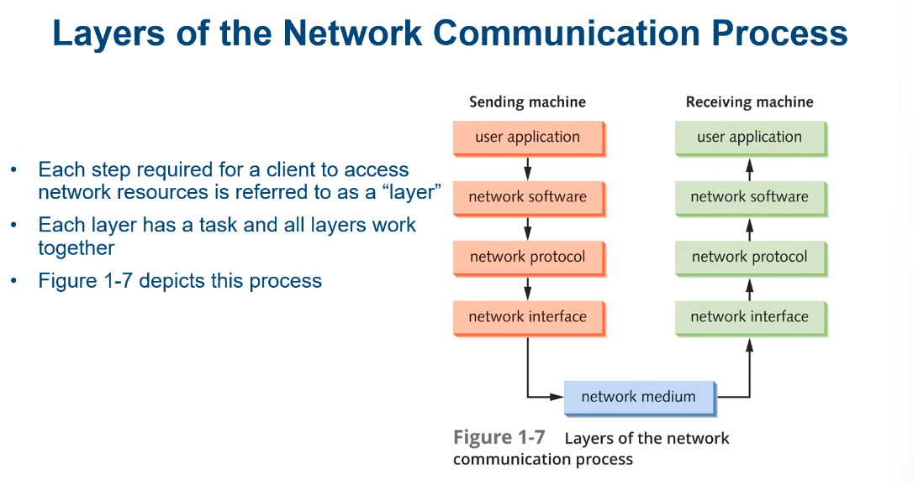
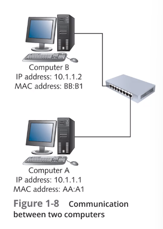
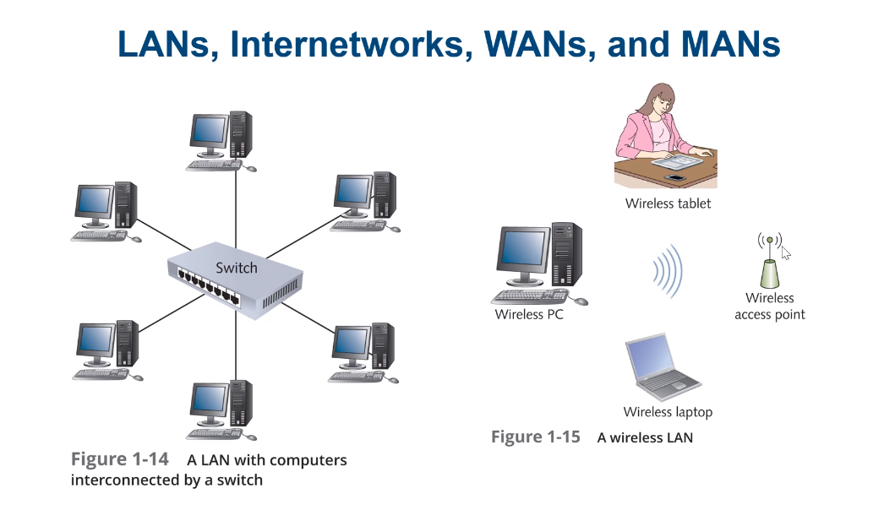
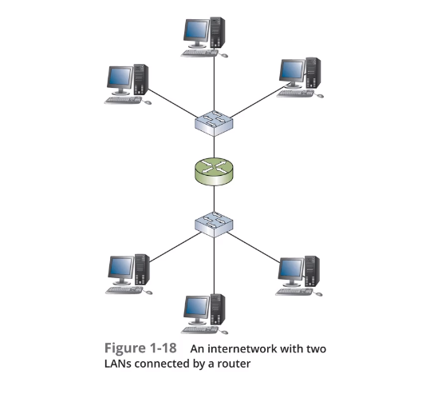
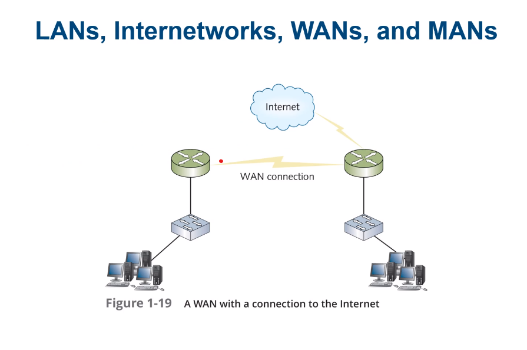

# Topic 1B The Fundermental of Network Communication

# Table of Contents
- [Topic 1B The Fundermental of Network Communication](#topic-1b-the-fundermental-of-network-communication)
- [Table of Contents](#table-of-contents)
- [Network Components](#network-components)
- [Steps of Network Communication](#steps-of-network-communication)
- [Layers of Networking Communication Process](#layers-of-networking-communication-process)
- [How Two Computers Communicate Local Area Network (LAN)](#how-two-computers-communicate-local-area-network-lan)
- [LANs, Internetworks, MANs, WANs](#lans-internetworks-mans-wans)
- [Internet, Intranet, Extranet](#internet-intranet-extranet)
- [Packets and Frames](#packets-and-frames)

-----------------

# Network Components 
- Hardware components needed to turn on a stand-alone computer into a networked computer
- Network Interface Card (NIC) Plug-in card that connects a computer to a network
- Network Media (Cable) - Connects the NIC to the network
- Network Operating System (NOS) - Software that allows a computer to communicate over a network

- Interconnection Devices - Connects multiple computers together on a network
- Hub - Connects multiple computers together on a network

# Steps of Network Communication

1. Application tries to access a network resource
2. Client software formats the request
3. Protocol stacks format the request into packets
4. NIC sends the packets onto the network
5. Packets are routed to the destination

- These are the same steps that occur when a computer accesses a resource on the Internet

# Layers of Networking Communication Process

|Step|Layer|Description|
|----|-----|-----------|
|1|Application|The application layer is the layer that the user interacts with. It is the layer that the user sees.|
|2|Presentation|The presentation layer is responsible for formatting the data so that it can be read by the application layer.|
|3|Session|The session layer is responsible for establishing, maintaining, and terminating connections between applications.|
|4|Transport|The transport layer is responsible for breaking the data into segments and reassembling it at the destination.|
|5|Network|The network layer is responsible for addressing and routing the data between applications.|
|6|Data Link|The data link layer is responsible for formatting the data into frames so that it can be read by the network layer.|
|7|Physical|The physical layer is responsible for converting the data into bits so that it can be transmitted over the network.|

# How Two Computers Communicate Local Area Network (LAN)
- TCP/IP is the protocol suite used on the Internet
- TCP/IP uses 2 addresses to identify a computer on a network
- IP Address - Logical address that identifies a computer on a network
- MAC Address - Physical address that identifies a computer on a network

- Just as a mailing person needs a street address and a name to deliver a letter, a computer needs an IP address and a MAC address to deliver a packet
- Think of the Logical Address as the street address and the Physical Address as the name
- The IP address is the logical address that identifies a computer on a network

1. A user at Computer A types in the IP address of Computer B (Example: 10.1.1.2)
2. Network Interface Card (NIC) at Computer A sends out an ARP request to find the MAC address of Computer B
3. The Network Protocol Stack at Computer A formats the data into packets
4. The NIC at Computer A sends the packets onto the network
5. The network interface software adds the MAC address of Computer A to the packet
6. Computer B receives the packets and strips off the MAC address
7. The network protocol stack at Computer B reassembles the packets into data
8. The data is sent to the application

# LANs, Internetworks, MANs, WANs
- LAN (Local Area Network) - A network that connects computers in a limited geographical area
- An **Internetwork** is a network collections of LANs tied together by devices called routers
- Reasons for creation
    - Two or more groups of users need to share resources
    - Number of users and/or resources is too large for a single LAN
    - The distance between two groups of computer 

- Wide Area Network (WAN) - A network that connects computers over a large geographical area
- Metropolitan area network (MAN) - A network that connects computers in a metropolitan area
- Campus Area Network (CAN) - A network that connects computers in a limited geographical area, such as a college campus

# Internet, Intranet, Extranet

- The Internet is a worldwide collection of networks that connects millions of businesses, government agencies, educational institutions, and individuals
- The Internet is a public network

- An Extranet is a private network that uses Internet technologies to share business information with select corporate partners or key customers

- An Intranet is a private network that uses Internet technologies to share company information among employees

# Packets and Frames

- Computers transmit data in the form of packets
- information is broken into small pieces called packets
- Reasons for data to be broken into packets
    - Packets can travel different routes to the destination
    - Packets can be reassembled at the destination
    - Packets can be sent at the same time
    - Packets can be sent to multiple destinations

